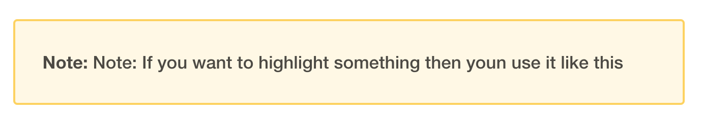
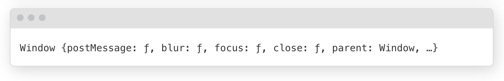
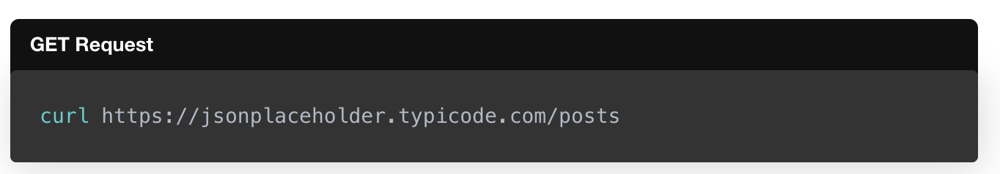

- You can start by italic style para in the blog like this - *this is italic*

- You can hyperlink the code keywords like - [`this`](https://developer.mozilla.org/en-US/docs/Web/JavaScript/Reference/Operators/this) OR [`this` and `that`](www.google.com)

- Quoted text to highlight somethis like -
> Note: If you want to highlight something then youn use it like this



- To highlight browser/terminal -

```terminal
Window {postMessage: ƒ, blur: ƒ, focus: ƒ, close: ƒ, parent: Window, …}
```



- Tables

| Method   | Endpoint                                                                                       |
| -------- | ---------------------------------------------------------------------------------------------- |
| `GET`    | [`https://jsonplaceholder.typicode.com/posts`](https://jsonplaceholder.typicode.com/posts)     |
| `POST`   | [`https://jsonplaceholder.typicode.com/posts`](https://jsonplaceholder.typicode.com/posts)     |
| `PUT`    | [`https://jsonplaceholder.typicode.com/posts/1`](https://jsonplaceholder.typicode.com/posts/1) |
| `PATCH`  | [`https://jsonplaceholder.typicode.com/posts/1`](https://jsonplaceholder.typicode.com/posts/1) |
| `DELETE` | [`https://jsonplaceholder.typicode.com/posts/1`](https://jsonplaceholder.typicode.com/posts/1) |

- Show file name or information before the code snippets -

<div class="filename">GET Request</div>

```bash
curl https://jsonplaceholder.typicode.com/posts
```


- Badge Logos - https://github.com/jalbertsr/logo-badge-images
