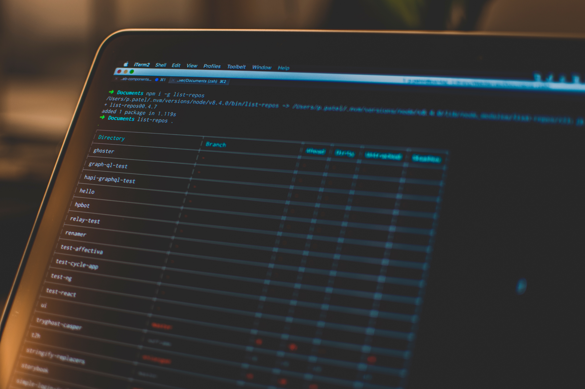

There are various task that need to run on background. For e.g. there are some process like node that we want them to run in background. So basically we want to run our command even though we close the terminal or close SSH connection. You might have faced the situation where your task was running and SSH connection drops and you lost your work. So there is utility `screen` that can resume our session.

Screen is one of the popular utility to run task in background. It allows you to keep multiple terminal session open and easily switch between them.

Screen also helps you from disconnect or terminate your task. Because screen session doesn’t drop when your ssh connection gets drop.

To start with, you have to make sure that screen utility is installed on your machine or server.

## Installation

To install screen on ubuntu,
```sh
sudo apt-get install screen
```

On CentOS or Fedora
```sh
sudo yum install screen
```

## Commands

- To start new screen
```sh
screen -s <screenName/screenId>
```

- To view all screen
```sh
screen -ls
```

- To detach from screen session. ( Detach screen means — we can keep that screen session as it is.) use ctrl+a+d

- Reattach to screen
```sh
screen -r <screenName/screenId>
```

- To remove screen
```sh
screen -X -R <screenName/screenId>
```
There are lot of other commands you can check `man screen` docs.

Happy Coding 🔥