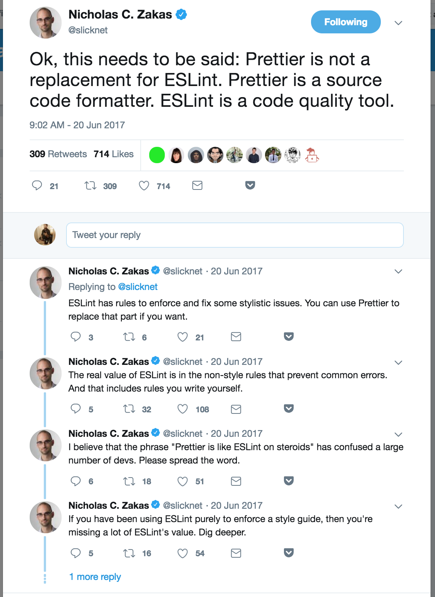

# Prettier

It is use to keep all your code well formated and uniformed.

* Install prettier as a dev dependency.

  ```js
  npm install -D prettier
  ```

* To format any file just you can use `npx prettier <fileName>`. If you want to write that formated to code back to the file then simply add write flag in it. So,
  ```js
  npx prettier App.js --write
  ```

## Prettier with VSCode

* Create .prettierrc file at root directory of your project. You can specify empty object in file `{}` to use default configuration of prettier. So you may think that why we need empty file to use default prettier configuration. Because VSCode can identify that _"oh! this is prettier project, I will auto format it"_
* Install prettier extension in vscode. [Extension Link](https://marketplace.visualstudio.com/items?itemName=esbenp.prettier-vscode)
* Go to VSCode setting and enable `prettier.requireConfig: true`. It just say to VSCode that if the poject has prettierrc file, run formatting. If it does not then do not run it. (Super helpful for other project which does not have prettier setup 💯)
* Enable one more setting in VSCode i.e. "editor.formatOnSave: true" which is self explanatory.
* If you specify any prettier setting in vscode then VSCode will check if you have prettier config file it will use that otherwise VSCode will use config settings.
*

## Continuous Integration

* If you do not want to auto format on save then you can scripts always come to rescue. Add below script in `package.json` file to format it through CLI.
  ```js
    "format": "prettier --write \"**/*.+(js|jsx|css|json|md|yml|yaml|graphql|less|sass|vue)\" "
  ```
* Above script will format all js, jsx, css and json files when you run `npm run format`
  > Note: If you want to ignore some files that you don't want to fomat then simply add `.prettierignore` file add files in it.
* This is very useful in continous integration. If you want to failt the build when somebody does not care to format the code then you can make your CI to fail the build and it will be caught by your CI tool (TravisCI or Circle).
* To fail the build if code is not formatted then use,
  ```js
  "format:check": "prettier --list-different \"/**/*.+(js|jsx|css|json|md|yml|yaml|graphql|less|sass|vue)\" "
  ```
* And add `npm run format:check` in your build configuration file

**Prettier is not replacement for ESLint**. They solve two different problems. Prettier formats your code but ESLint helps you to write better code, prevents bugs and ensures best practices. Nicholas Zakas (Creator of ESLint) said the best:



# ESLint

* Create a file called `.eslintrc.json` and paste below configuration in it

  ```json
  {
      "extends": [
        "eslint:recommended", // This is bare minimal eslint configuration that we are extending
        "prettier", // Above eslint come with some spacing and formatting stuff, but prettier will turn eslint formatting off.
        "prettier/react"
      ],
      "parserOptions": {
        "ecmaVersion": 2018, // Allow to use latest and greatest javascript feature in this project
        "sourceType": "module",
        "ecmaFeatures": {
          "jsx": true
        }
      },
      "env": {
        "es6": true,
        "browser": true,
        "node": true
      }
  }
  ```

* Install below dev depedencies,

  ```sh
  npm install -D eslint eslint-config-prettier eslint-plugin-prettier
  ```

* Lastly, install ESLint extension in VSCode.[Extension Link](https://marketplace.visualstudio.com/items?itemName=dbaeumer.vscode-eslint)
* You can add script tag for linting,

```js
"lint": "eslint \"**/*.{js,jsx}\"",
```

* To ignore errors in file you can add comment: `/* global React ReactDOM */`
* Sometime it is hard to setup eslint so you can use below command to debug it properly.

```js
npm run lint -- --debug
```
