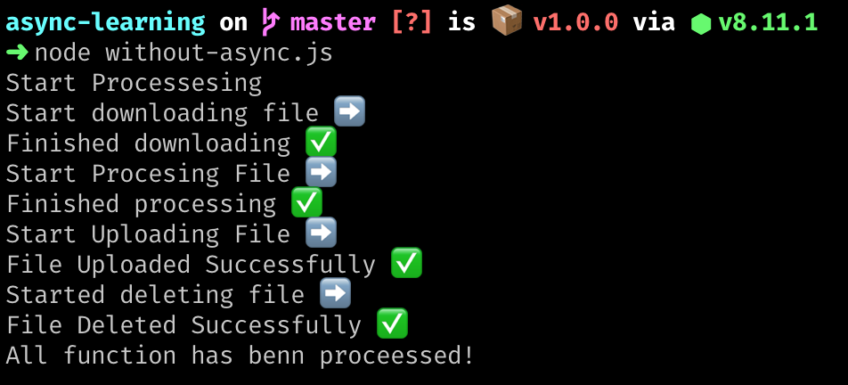

Let's consider simple example of file processing. If you want to do processing
on file then assume below steps:

1.  Download the file which you want to process
2.  Start processing the fle
3.  Upload processed file to the destination
4.  Delete original file

If you want to do these tasks in nodejs then it needs to be one after another. In traditional way you can achieve this using callbacks.

Here is simple code that illustrate the example:

```javascript
const startProcessing = function() {
  console.log('Start Processesing');
  download(function() {
    process(function() {
      upload(function() {
        del(function() {
          console.log('All function has benn proceessed!');
        });
      });
    });
  });
};

const download = function(callback) {
  console.log('Start downloading file ➡️');
  delay();
  console.log('Finished downloading ✅');
  callback(null, 'Downloaded data');
};

const process = function(callback) {
  console.log('Start Procesing File ➡️');
  delay();
  console.log('Finished processing ✅');
  callback();
};

const upload = function(callback) {
  console.log('Start Uploading File ➡️');
  delay();
  console.log('File Uploaded Successfully ✅');
  callback();
};

const del = function(callback) {
  console.log('Started deleting file ➡️');
  delay();
  console.log('File Deleted Successfully ✅');
  callback();
};

// Mock up function to illustrate the real time scenario
const delay = function() {
  for (let index = 0; index < 10000; index++) {
    for (let x = 0; x < 100000; x++) {
      //do nothing
    }
  }
};

startProcessing();
```

The above code will run each function one after another and gives below output.



But did you saw `startProcessing` function. It is what we called "Callback Hell", our super helpful friend 😅

So imagine if you have lots of other function that needs to be executed one after another then how your code will look and how you will maintain the code and as always debugging will be nightmare.

So `Async` module come to rescue and can help us to write the code in better way. You can install it using `npm install async`

We can utilize `waterfall` method which will be helpful in this situation. We can replace `startProcessing` function to use `async.waterfall`. First paramter will be the array of task and second one is the global callback.

```javascript
const async = require('async');

const startProcessing = function() {
  console.log('Start Processesing');
  async.waterfall([download, process, upload, del], function(err, data) {
    if (err) {
      console.log('Error: ' + err);
    } else {
      console.log('Finished Processing');
    }
  });
};
```

This is lot cleaner and userful for debugging, right? See below full example:

```javascript
const async = require('async');

const startProcessing = function() {
  console.log('Start Processesing');
  async.waterfall([download, process, upload, del], function(err, data) {
    if (err) {
      console.log('Error: ' + err);
    } else {
      console.log('Finished Processing');
    }
  });
};

const download = function(callback) {
  console.log('Start downloading file ➡️');
  delay();
  console.log('Finished downloading ✅');
  // callback('Download Failed!!! 🐛', 'Downloaded data');
  callback(null, 'Downloaded data');
};

const process = function(data, callback) {
  console.log('Start Procesing File ➡️');
  console.log('The data is received from download: ', data);
  delay();
  console.log('Finished processing ✅');
  callback();
};

const upload = function(callback) {
  console.log('Start Uploading File ➡️');
  delay();
  console.log('File Uploaded Successfully ✅');
  callback();
};

const del = function(callback) {
  console.log('Started deleting file ➡️');
  delay();
  console.log('File Deleted Successfully ✅');
  callback();
};

const delay = function() {
  for (let index = 0; index < 10000; index++) {
    for (let x = 0; x < 100000; x++) {
      //do nothing
    }
  }
};

startProcessing();
```

Async module provide alot of methods to these kind of operations. Checkout the [documentation](http://caolan.github.io/async/).

Examples repo: https://github.com/sanketgandhi/async-module-examples

Happy Coding 🔥
