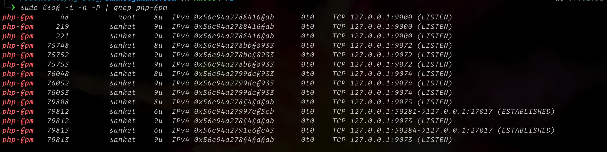

Creating this guide for self reference so that every time I don't waste time on this stuff do something productive and it will help others too.

Prerequisite: Before setting up nginx/php, you need `xcode` with CLI tools installed on your machine.

```sh
xcode-select --install
```

## PHP
Don't use default homebrew core tap for PHP 🤷🏻‍♂️. Use [shivammathur/php](https://github.com/shivammathur/homebrew-php). Using this you can easily install or switch between multiple php versions.
```shell
brew tap shivammathur/php
```

<!--- Clean up --->
**Note**: If you have packages from old `homebrew/php` tap, you can remove completly
<details>
<summary> Check this commands</summary>

```shell
# Remove PHP from Homebrew Cellar
rm -rf $(brew --cellar)/php

# Remove old PHP Launch Agents and daemons, if present:
rm -f ~/Library/LaunchAgents/homebrew.mxcl.php*
rm -f /Library/LaunchAgents/homebrew.mxcl.php*
rm -f /Library/LaunchDaemons/homebrew.mxcl.php*

# Remove homebrew/php tap
brew untap homebrew/php

# Cleanup
brew cleanup
```

</details>

<br />

Install php versions that you required. (Note, php gets install with php-fpm)

```shell
brew install shivammathur/php/php@7.2
brew install shivammathur/php/php@7.3
brew install shivammathur/php/php@7.4
brew install shivammathur/php/php@8.0
```

Set PHP 7.4 as your default php CLI version
```shell
brew unlink php
brew link --overwrite --force php@7.4
```

To run `php-fpm` you will need a unique port. Change ports of each php-fpm. We will match php version with port to easily understand running process -
```sh
vim /usr/local/etc/php/7.4/php-fpm.d/www.conf
```

<div class="filename">www.conf</div>

```sh
# You may want to change `user` and `group` from `_www`
user = <your_username>
group = staff

# Find `listen` and replace with following:
listen = 127.0.0.1:9074
```

Before starting php-fpm, you may want to change some defaults from `php.ini`.
```sh
max_execution_time = 30
memory_limit = 1024M
post_max_size = 1024M
file_uploads = On
upload_max_filesize = 1024M
max_file_uploads = 200
```

Finally fire up php-fpm
```sh
sudo brew services start php@7.2
sudo brew services start php@7.3
sudo brew services start php@7.4
sudo brew services start php@8.0
```

Verify that you have processes running and validate your ports
```sh
sudo lsof -i -n -P | grep php-fpm
```


Optionally, add aliases and replace `<your_version>` with the version homebrew installs.
```shell
alias php72="/usr/local/Cellar/php@7.2/<your_version>/bin/php"
alias php73="/usr/local/Cellar/php@7.3/<your_version>/bin/php"
alias php74="/usr/local/Cellar/php@7.4/<your_version>/bin/php"
# The latest version of php in be located under
# the "php" folder not an "@" folder.
alias php80="/usr/local/Cellar/php/<your_version>/bin/php"
# Make switching versions easy
function phpv() {
    brew unlink php
    brew link --overwrite --force "php@$1"
}
```

If you want to change the default php CLI you can set it using brew or alias we added above
```shell
# brew
brew unlink php
brew link --overwrite --force php@7.4
# bash function
phpv 7.4
```

## PHP Errors
As time passes Homebrew is bound to [break you PHP installations](https://stackoverflow.com/questions/53828891/dyld-library-not-loaded-usr-local-opt-icu4c-lib-libicui18n-62-dylib-error-run). When this happens you can [reinstall PHP version having the error](https://gist.github.com/hgrimelid/703691ab48c4a4d0537cfe835b4d55a6). Keep in midn you may need to reconfigure that version of PHP but `php.ini` file remain same
```shell
brew reinstall shivammathur/php/php@7.4
```

## Nginx
Install nginx
```shell
brew install nginx
sudo nginx
```
Test the installation by visiting `http://localhost:8080`.

Now, change default settings by going to `/usr/local/etc/nginx/nginx.conf`
```shell
listen 80;
server_name localhost test.x;
index index.html index.htm index.php;
```

Next, add FastCGI gateway to php-fpm on the default server -
```sh
location ~ \.php$ {
  fastcgi_param SCRIPT_FILENAME $document_root$fastcgi_script_name;
  include fastcgi_params;
  fastcgi_pass 127.0.0.1:9074;
  fastcgi_split_path_info ^(.+\.php)(/.+)$;
}
```

Add some basic security to your default server -
```sh
add_header X-Frame-Options "SAMEORIGIN";
add_header X-XSS-Protection "1; mode=block";
add_header X-Content-Type-Options "nosniff";
```

Add charset,
```sh
charset utf-8;
```

Allow large file upload,
```shell
http {
    ...
    client_max_body_size 100M;
}
```
Next, create `index.php` file on `/usr/local/var/www/index.php` path and add `phpinfo()`

Reload nginx
```shell
sudo nginx -s reload
```

To test nginx config
```shell
nginx -t
```

To add more server you can go to the nginx `servers` dir, `/usr/local/etc/nginx/servers` and add individual files. [Checkout this template](https://gist.github.com/sanketgandhi/809dd13df1bfd5876626136c4e888885.js)

Checkout below resources:
- https://medium.com/@ThomasTan/installing-nginx-in-mac-os-x-maverick-with-homebrew-d8867b7e8a5a
- https://serverfault.com/questions/845766/generating-a-self-signed-cert-with-openssl-that-works-in-chrome-58
- https://medium.com/@wvervuurt/how-to-run-multiple-php-versions-simultaneously-under-os-x-el-capitan-using-standard-apache-98351f4cec67
- https://kevdees.com/macos-11-big-sur-nginx-setup-multiple-php-versions/


Cheers!