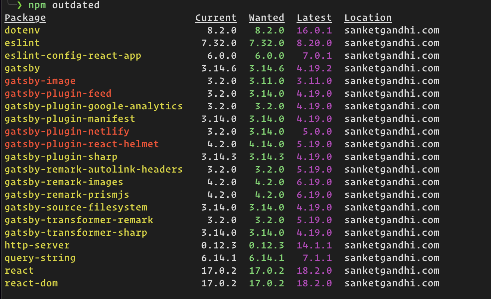
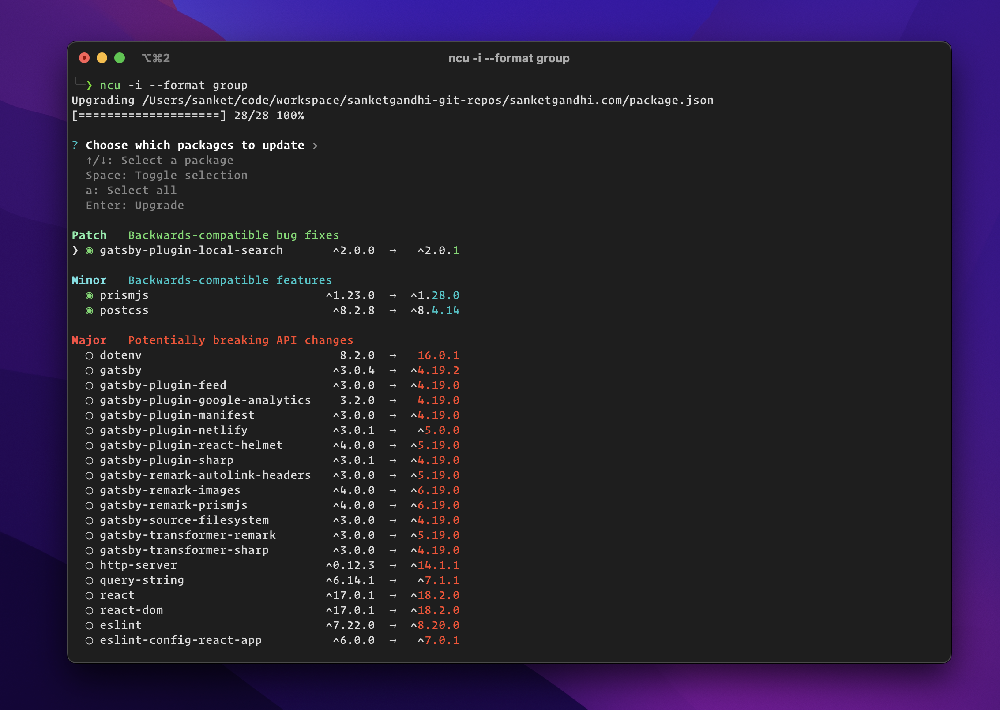

Recently, I've been getting mail from github dependency bot that I need to update my npm packages. Bot was raising PRs individually for every package. I wanted to fix it in one go. NPM packages can be of frontend app or nodejs app, process for updating packages are same.

There are multiple ways to update npm packages -

- Manual process
- Using `npm outdated` command
- Using `npm-check-updates` package

## Manual process

1. Update package.json file by checking version on [semver calculator](https://semver.npmjs.com/)
2. Run `npm install`

## Using `npm outdated` command

Use `npm outdated` and `npm update` command to check for and update to newer versions of your packages.



- `Current` is what you have installed
- `Wanted` is the latest version that satisfies the semver range in package.json
- `Latest` is the latest version that is available on npm
  
Red items means the wanted version is also the latest (check above image)

### npm update

This command will update all packages to `wanted` version.

For example, if I have "dotenv": "^8.2.0" then on running `npm update dotend` command will change it to "^8.6.0" and **NOT** "^9.0.0"

## Using `npm-check-updates` package

This is my favorite way to update npm packages. First, I recommend you to install this package globally on your system. You can use `npx` but it takes more time to complete.

#### 1. Install `npm-check-updates` package globally

```bash
npm install -g npm-check-updates
```

Note: [Check complete documentation of npm-check-updates](https://www.npmjs.com/package/npm-check-updates)

#### 2. Run NPM Check Updates

Go to your project directory and run following command

```bash
ncu -i --format group
```

This will present you like this -



It will group Major, Minor, Patch versions and you can select packages that you want to update. Once done, package will ask you whether to run `npm install` or not. Make sure to run it so that packages gets updated.

There is downside of above command is if you don't want to update to major version of package but wanted to make sure you are on latest minor and patch version. To do this, I recommend to update Major, Minor and Patch version separately.

#### 3. Update Patches

First, update all patches of your project. So, assuming that your package maintainers are following semantic versioning, this shouldn't break anything.

```bash
ncu -u -t patch
```

Run `npm i` to install all updates and make sure everything is working locally. Commit changes so you can revert if required.

#### 4. Update Minor versions

Second step is to update all packages with latest minor version. This will not break anything if package maintainers are following semantic versioning.

```bash
ncu -u -t minor
```

Run `npm i` to install all updates and make sure everything is working locally. Commit changes so you can revert if required.

#### 5. Update Major versions

Lastly, update all packages with latest major version. **This step may break your project.** Before you do this, make sure you read all the release notes and check what all breaking changes are introduce.  If you know what is going to affect in your code then commit each major version in spearate commit.

For exammple, to update react to major version

```bash
ncu -u -t -f react
```

Run `npm i` to install all updates and make sure everything is working locally. Commit changes so you can revert if required.

## Conclusion

Whatever you choose, make sure you know what you are doing! 😉

Cheers!
