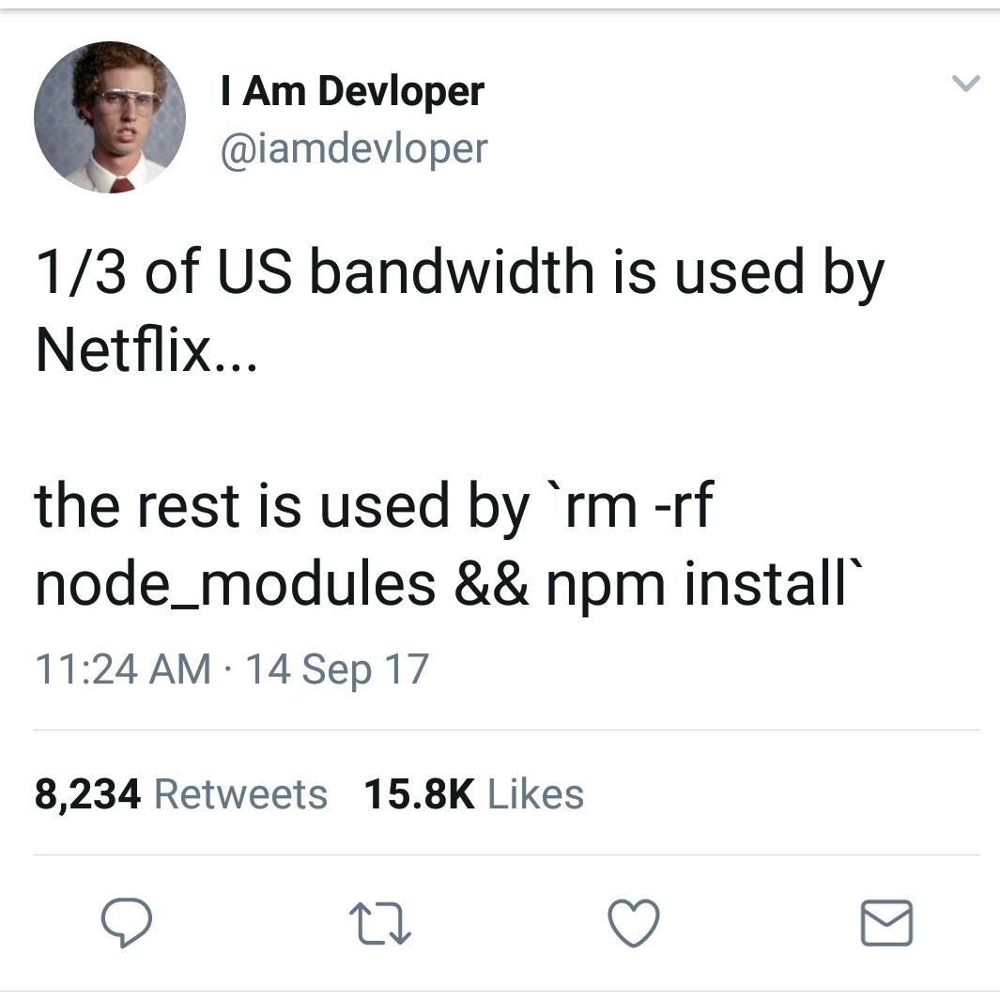

Now a days every project got hell lot of dependencies. In PHP world, composer is installing dependencies in `vendor` folder. That's great! Rule in holy book is you should never commit `vendor` folder (or `node_modules` in case of npm) to git. 

If you commit it then be ready -


Everyone know this rule but if there is situation where you need to change functionality of library that you installed. 

##### Possible solutions? 🤔
1. Fork library and change whatever behavior you want to change. Problem with this approach if your changes are less then it does not make sense to fork lib and then maintain it. If there is version upgrade in original lib then you need to upgrade your fork lib version. And it is pain!

2. Create PR to original library and wait for author of library to merge PR. PR might not get merged as well due gazillions of reasons.

3. What if I told you there is a way where you define your file in your project and composer will give priority to YOUR file instead of vendor file. Cool, right? 

### Override vendor file
Let say you need to override file of framework core file (damn!) then copy that file in your project. I usually prefer to have `override` folder in `app` folder of laravel which will contain same hierarchy as that of vendor.

Then we need to inform composer where our file is present and it will override which file inside vendor folder.

- Open `composer.json`, inside `autoload` define `exclude-from-classmap` and path of file which need to exclude from vendor
- Then define `files` which will have our file path
- Run `composer dump-autoload`
  
For example,

```json
// ... 
"autoload": {
	"exclude-from-classmap": [
		"vendor/illuminate/validation/Rule.php"
	],
	"files": [
		"app/override/illuminate/validation/Rule.php"
	]
},
// ...
```

## Last meme 😂



That's it, folks. 

Cheers!
