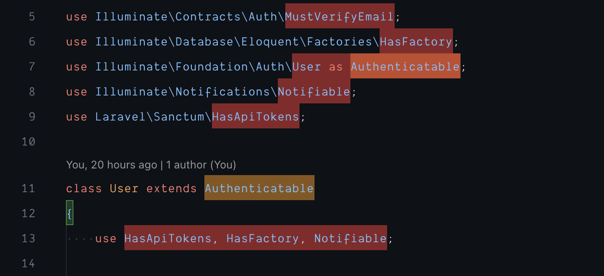

I wasted 4 hours since I didn't find any article on internet which can give me steps to debug extensions easily and hence this write-up!

I stumbled on VSCode one day where it was highlighting code block in red and yellow like this -
****

It was driving me nuts and I wasted 4 hours to check whether this is shown by vscode by default or some extensions.

When I googled then I found nothing related to this so I decided to disable all my extensions and I successfully got to know that it was some extension who was doing this.

So, obvious solution that came to mind was to disable all related extensions (like linter, etc) but it was not helping and it was too much time consuming.

I decided to look into vscode docs if they have something to debug extensions which is causing issue.

Luckily I found **Extension Bisect** feature! It is very simple and smart technique. It just use divide and conquer technique. It is beautiful way to detect bad extension.

Go to command palette and search for "Help: Start Extension Bisect".

It will start disabling all extension at very beginning and will ask to replicate the issue. If you see issue is resolved then click on button "Good now".

Then, vscode will disable half of extension and again ask you whether issue is replicable. At one point your issue will get replicate and then you need to click on "This is bad" button.

You need to repeat this step unless you find single extension which is bad and get ride of that extension or setting. [Check vscode documentation on it](https://code.visualstudio.com/blogs/2021/02/16/extension-bisect).

Cheers!
