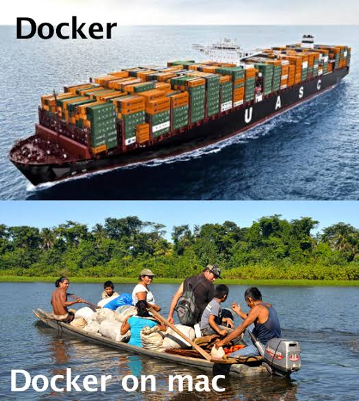

Now a days everyone is using docker on their machine. Docker work wayyyy better with linux than macOS. Windows (WSL) works great with docker too and we struggle with macOS. It is due to the way docker works inside macOS. Docker runs in virtual machine on macOS that's why this weird slowness problems present in it.

I tweak couple of settings today since when docker run then my machine then it does not let me do my work. I had to stop containers in order to resume my work and it is real pain.

Here are some tweaks that may be useful to someone who is in deep pain like my machine was! 😅

First, go to docker desktop settings using command+, or click gear icon on top right.

1. In General tab, look for "Choose file sharing implementation for your containers" and change that to "VirtioFS" and this single setting will make your docker super fast 🚀
2. In Resource tab > Advanced, adjust cpu, memory, and swap. You may need to first check how much memory you need using `docker stats` command. Check fourth column which is memory usage for your container. Based on that you can change memory. If your container takes more memory than configured one then it will start swapping the memory and your machine will go on ventilator and might need ambulance with doctor 😂 jk!

Once these settings are configured then restart your docker and you are good to go. Try this and remember you can always revert these setting if you lick on bug icon on right top corner and choose reset to factory default.

Tip: Checkout [CTOP](https://ctop.sh/) like HTOP but for containers! 😉

Godspeed ✌🏻
